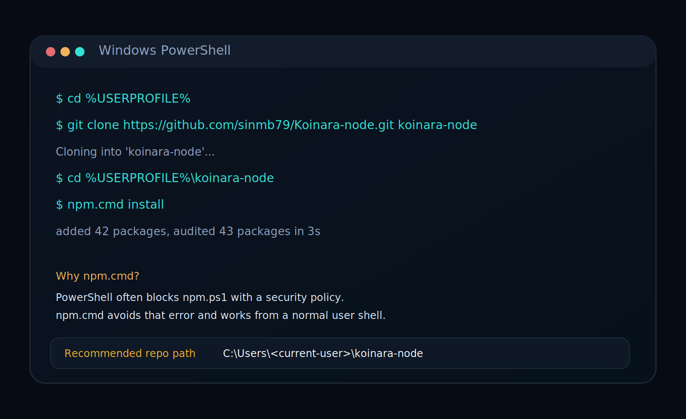
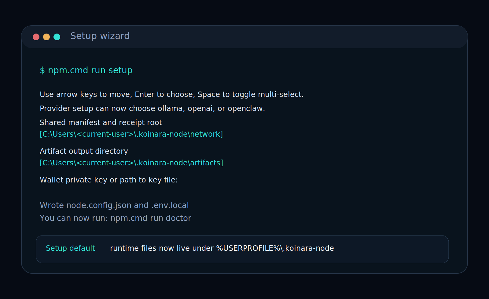
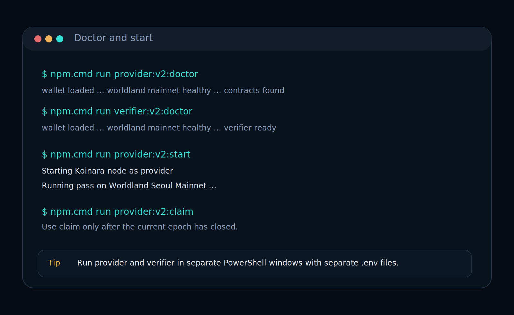

# Install Koinara-node on Windows

This is the first-time Windows guide for a normal operator.

The primary operator path is now fixed to:

1. `Worldland`
2. `OpenClaw`
3. `Koinara-node`

That means setup no longer tries to finish OpenClaw inside the same wizard. The operator installs the node first, then lets the OpenClaw-connected path finish the provider-side onboarding.

## If you use OpenClaw, hand this guide to the agent

You do not need to manually type every command yourself.

If you already have an OpenClaw chat window, give the agent this GitHub document and tell it:

```text
Use this guide as the exact installation and connection checklist:
https://github.com/sinmb79/Koinara-node/blob/main/docs/install-windows.md

Install Koinara-node under %USERPROFILE%\koinara-node, run setup, switch the v2 runtime to the local Worldland RPC if available, run openclaw:connect, run provider:v2:openclaw:check, then run provider:v2:openclaw:start. After each stage, tell me what is connected, which RPC is being used, what the current epoch is, and when rewards become claimable.
```

The idea is simple:

- the human operator approves the overall direction
- the OpenClaw agent executes the repetitive shell work
- `Koinara-node` remains the on-chain execution boundary

Security rule for early operators:

- do not run requester jobs through your personal OpenClaw chat agent
- create or use a dedicated Koinara worker profile
- keep that worker away from personal files, browser sessions, wallet files, and private notes
- prefer `WALLET_KEYFILE` over an inline private key in `.env.local`

## Step 1. Clone into your user folder

Open a fresh PowerShell window and run:

```powershell
cd $env:USERPROFILE
git clone https://github.com/sinmb79/Koinara-node.git koinara-node
cd $env:USERPROFILE\koinara-node
npm.cmd install
```



Why this path:

- it avoids mixing the repo with `Desktop`
- it avoids running from `system32`
- it keeps the repo under `C:\Users\<current-user>\koinara-node`

Why `npm.cmd`:

- Windows PowerShell often blocks `npm.ps1`
- `npm.cmd` avoids the execution-policy error

If you want a one-command bootstrap for the node repo only:

```powershell
powershell -ExecutionPolicy Bypass -File .\scripts\bootstrap-windows.ps1
```

## Step 2. Run setup for the base node config

Run:

```powershell
npm.cmd run setup
```



This setup now does only the base node work:

- role
- network profile
- network selection mode
- enabled networks
- runtime folder defaults
- wallet now or later

It does **not** connect OpenClaw or Ollama inside the wizard anymore.

The current defaults place runtime files under your home folder:

- shared manifest root: `%USERPROFILE%\.koinara-node\network`
- artifact root: `%USERPROFILE%\.koinara-node\artifacts`
- state root: `%USERPROFILE%\.koinara-node\state`

The setup wizard uses interactive menus:

- `Up` / `Down` to move
- `Enter` to choose one option
- `Space` to toggle on multi-select screens

For a normal first-time Worldland operator, the common choices are:

- role: `both`
- network profile: `mainnet`
- network selection mode: `priority-failover`
- enabled networks: `worldland`

Setup writes:

- `node.config.json`
- `.env.local`

If you skipped the wallet, that is fine.
You can add `WALLET_KEYFILE` later before starting the node.

## Step 3. Connect OpenClaw

After setup, follow the OpenClaw provider path.

If you plan to use your own synced Worldland node instead of the public RPC, do this first:

```powershell
Copy-Item .\config\networks.mainnet.v2-local.example.json .\config\networks.mainnet.v2-local.json
```

That switches the Worldland v2 runtime to:

- `http://127.0.0.1:8545`

before you start the provider.

```powershell
npm.cmd run openclaw:connect
```

What this does:

- updates the node config for an OpenClaw-backed provider
- writes the v2 runtime config files
- installs the bundled Koinara OpenClaw skill
- checks the OpenClaw CLI
- checks that the local `main` agent replies

If this succeeds, the next commands are:

```powershell
npm.cmd run provider:v2:openclaw:check
npm.cmd run provider:v2:openclaw:start
```

## Step 4. Check and start

```powershell
npm.cmd run provider:v2:openclaw:check
npm.cmd run provider:v2:openclaw:start
```

If you also run a verifier, use a second PowerShell window:

```powershell
cd $env:USERPROFILE\koinara-node
npm.cmd run verifier:v2:status
npm.cmd run verifier:v2:start
```



What success looks like:

- provider logs repeating runtime passes
- when a job is accepted, provider logs lines such as:
  - `worldland: provider submitted response for job <jobId> (<responseHash>)`
- verifier logs lines such as:
  - `worldland: verifier approved job <jobId>`
  - `worldland: verifier finalized PoI for job <jobId>`
- status and check commands show:
  - current epoch
  - next epoch close time
  - recent jobs
  - reward state

If you use the local Worldland node path, also make sure:

- your local `worldland.exe` is already synced enough to see the live v2 contracts
- `eth_blockNumber` is not stuck at `0x0`
- `net_peerCount` is above `0x0`

## Step 5. After reboot

You do not need to install again after a reboot.

For an OpenClaw-backed provider:

```powershell
cd $env:USERPROFILE\koinara-node
npm.cmd run provider:v2:openclaw:check
npm.cmd run provider:v2:openclaw:start
```

For a verifier:

```powershell
cd $env:USERPROFILE\koinara-node
npm.cmd run verifier:v2:status
npm.cmd run verifier:v2:start
```

## Step 6. Claim after the current epoch closes

Koinara v2 protocol rewards are not minted immediately.

They become claimable after the current epoch closes.

If you use OpenClaw:

```powershell
npm.cmd run provider:v2:openclaw:claim
```

Verifier claim:

```powershell
npm.cmd run verifier:v2:claim
```

## Troubleshooting

### OpenClaw connect says the CLI is not ready

Run:

```powershell
openclaw.cmd --help
npm.cmd run openclaw:check
```

If the skill somehow needs a manual reinstall:

```powershell
npm.cmd run openclaw:install
```

### You are in `C:\Windows\System32`

Do not run the repo scripts from there.

Move back to the repo first:

```powershell
cd $env:USERPROFILE\koinara-node
```

### PowerShell blocks `npm`

Use:

```powershell
npm.cmd install
npm.cmd run setup
```

instead of plain `npm`.

### You want to use a synced local Worldland node

Run your local Worldland node with HTTP JSON-RPC enabled:

```powershell
& "C:\Program Files\worldland\worldland.exe" --seoul --http --http.addr 127.0.0.1 --http.port 8545 --http.api eth,net,web3 console
```

Then copy the v2 local override:

```powershell
Copy-Item .\config\networks.mainnet.v2-local.example.json .\config\networks.mainnet.v2-local.json
```

The v2 Worldland commands will then read `config/networks.mainnet.v2-local.json` automatically.

### Ollama

`Ollama` is no longer the primary onboarding path.
It can return later as an advanced or later-stage option, but the early operator path is intentionally fixed to `Worldland + OpenClaw + Koinara`.
