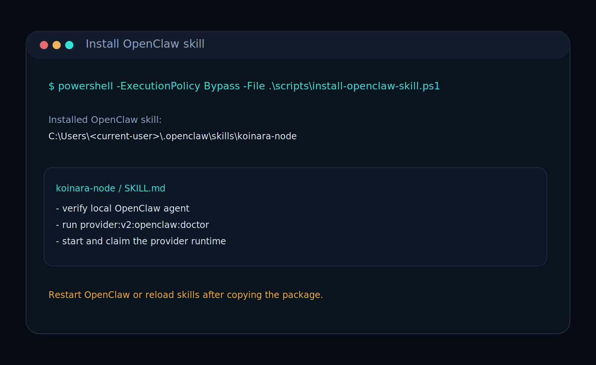
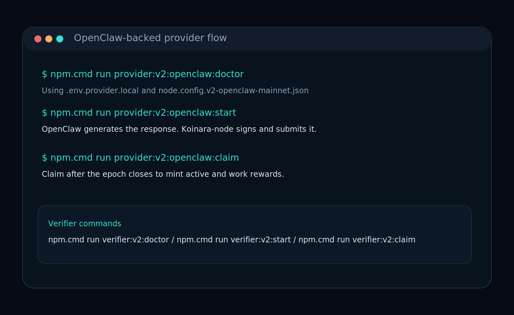

# OpenClaw Setup Guide

This guide is for operators who want:

- OpenClaw to generate provider-side inference
- `Koinara-node` to keep control of registration, heartbeat, submission, verification, and reward claims

The intended flow is now:

1. finish `npm.cmd run setup`
2. run one OpenClaw connection command
3. check
4. start

## Step 1. Finish the base node setup first

From the repo root:

```powershell
cd $env:USERPROFILE\koinara-node
npm.cmd run setup
```

During setup, you do **not** need to connect OpenClaw anymore.
That is a separate step now.

## Step 2. Connect OpenClaw in one step

Run:

```powershell
npm.cmd run openclaw:connect
```

This one command does the OpenClaw-side onboarding for Koinara:

- configures the provider backend as `openclaw`
- writes the v2 runtime config
- installs the bundled Koinara OpenClaw skill
- checks that `openclaw.cmd` exists
- checks that the local `main` agent replies

If you are using a synced local Worldland node on `127.0.0.1:8545`, copy this file before you continue:

```powershell
Copy-Item .\config\networks.mainnet.v2-local.example.json .\config\networks.mainnet.v2-local.json
```

The Worldland v2 runtime will prefer that file automatically.

If the command ends with all checks ready, OpenClaw is connected to the Koinara provider path on this computer.



## Step 3. Check the OpenClaw-backed provider path

Run:

```powershell
npm.cmd run provider:v2:openclaw:check
```

This is the human-readable status command.
It shows:

- whether the provider config is ready
- current epoch
- next epoch close time
- recent jobs
- reward state

It does not keep the node active by itself.
Treat it as a readiness snapshot, not as proof that future epoch rewards are secured.

If you want the low-level OpenClaw-only check:

```powershell
npm.cmd run openclaw:check
```

That checks:

- OpenClaw CLI
- installed Koinara OpenClaw skill
- local `main` agent response

## Step 4. Start the provider runtime

Run:

```powershell
npm.cmd run provider:v2:openclaw:start
```

This keeps:

- node registration
- heartbeat
- job polling
- OpenClaw-backed provider inference
- on-chain provider submission

If you close this process, future heartbeats stop.
That means later epochs can miss active rewards even if `check` looked healthy earlier.

When jobs are processed, the terminal prints lines like:

- `worldland: provider submitted response for job <jobId> (<responseHash>)`

If you also run a verifier:

```powershell
npm.cmd run verifier:v2:openclaw:status
npm.cmd run verifier:v2:openclaw:start
```



## Step 5. Claim after epoch close

Provider claim:

```powershell
npm.cmd run provider:v2:openclaw:claim
```

Verifier claim:

```powershell
npm.cmd run verifier:v2:openclaw:claim
```

KOIN is not minted immediately in v2.
Rewards become claimable after the current epoch closes.

## After reboot

You do not need to install again.

Run:

```powershell
cd $env:USERPROFILE\koinara-node
npm.cmd run provider:v2:openclaw:check
npm.cmd run provider:v2:openclaw:start
```

If you rely on Windows auto-start, rerun the installer once after moving the repository or replacing an older launcher path:

```powershell
powershell -ExecutionPolicy Bypass -File .\scripts\install-autostart.ps1
```

## Troubleshooting

### `openclaw:connect` says CLI is not ready

Run:

```powershell
openclaw.cmd --help
npm.cmd run openclaw:check
```

### You only want to reinstall the skill

Run:

```powershell
npm.cmd run openclaw:install
```

### You are in `C:\Windows\System32`

Move back to the repo first:

```powershell
cd $env:USERPROFILE\koinara-node
```

## Important rule

OpenClaw is the inference and agent layer.
`Koinara-node` remains the protocol execution boundary.

Without `Koinara-node`, OpenClaw alone does not participate on-chain.
