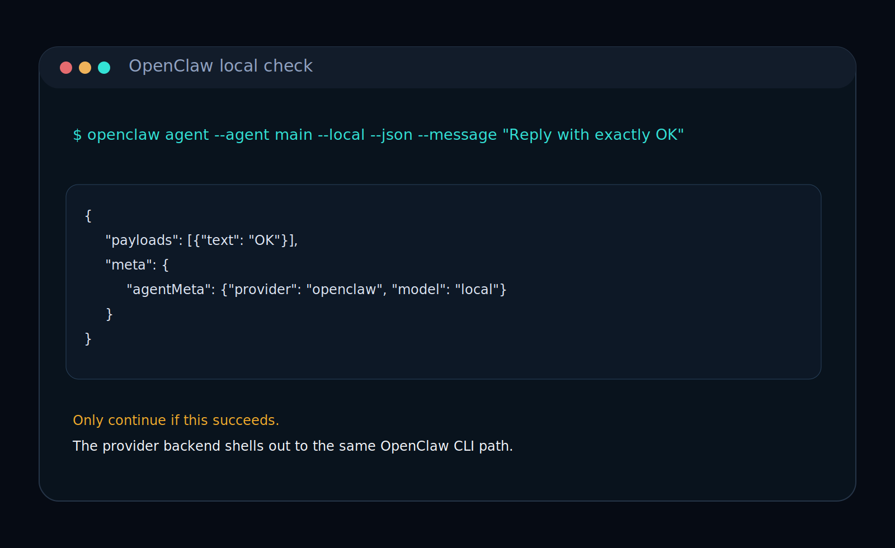

# OpenClaw Setup Guide

This is the GitHub-readable step-by-step path for connecting OpenClaw to `Koinara-node`.

Use this guide when you want:

- OpenClaw to generate provider-side inference
- `Koinara-node` to keep control of registration, heartbeat, submission, verification, and reward claims

## Step 1. Verify the local OpenClaw agent

Run this first:

```powershell
openclaw agent --agent main --local --json --message "Reply with exactly OK"
```



Do not continue until this returns a valid JSON payload.

## Step 2. Install the bundled Koinara OpenClaw skill

From the repo root:

### Windows PowerShell

```powershell
powershell -ExecutionPolicy Bypass -File .\scripts\install-openclaw-skill.ps1
```

### macOS / Linux

```bash
bash ./scripts/install-openclaw-skill.sh
```


This installs the skill into:

- Windows: `C:\Users\<user>\.openclaw\skills\koinara-node`
- macOS / Linux: `~/.openclaw/skills/koinara-node`

## Step 3. Run the OpenClaw-backed provider path

If you choose `OpenClaw agent` during `npm.cmd run setup`, setup will:

- enable the OpenClaw provider backend
- use the default CLI command `openclaw`
- use the default agent id `main`
- default to local execution on the current machine
- run a quick OpenClaw connection check before saving
- try to install the bundled Koinara OpenClaw skill automatically

You only need to customize the CLI path if `openclaw` is not already available on your shell path.

Use the dedicated Worldland v2 commands:

```powershell
npm.cmd run provider:v2:openclaw:doctor
npm.cmd run provider:v2:openclaw:check
npm.cmd run provider:v2:openclaw:start
npm.cmd run provider:v2:openclaw:claim
```

What each command is for:

- `provider:v2:openclaw:doctor`
  - configuration and network readiness
- `provider:v2:openclaw:check`
  - one-shot human-readable check for connection state, recent jobs, current epoch, next epoch close, and claimable rewards
- `provider:v2:openclaw:start`
  - live runtime that receives jobs and submits responses
- `provider:v2:openclaw:claim`
  - claim rewards after the current epoch closes

If you also run a verifier:

```powershell
npm.cmd run verifier:v2:doctor
npm.cmd run verifier:v2:openclaw:check
npm.cmd run verifier:v2:start
npm.cmd run verifier:v2:claim
```


## What OpenClaw does

- agent orchestration
- prompt execution
- provider-side response generation

## What Koinara-node still does

- node registration
- heartbeat
- manifest and receipt handling
- canonical response hashing
- provider submission
- verifier actions
- active and work reward claims

## Important rule

OpenClaw is the inference and agent layer.
`Koinara-node` remains the protocol execution boundary.

Without `Koinara-node`, OpenClaw alone does not participate on-chain.
